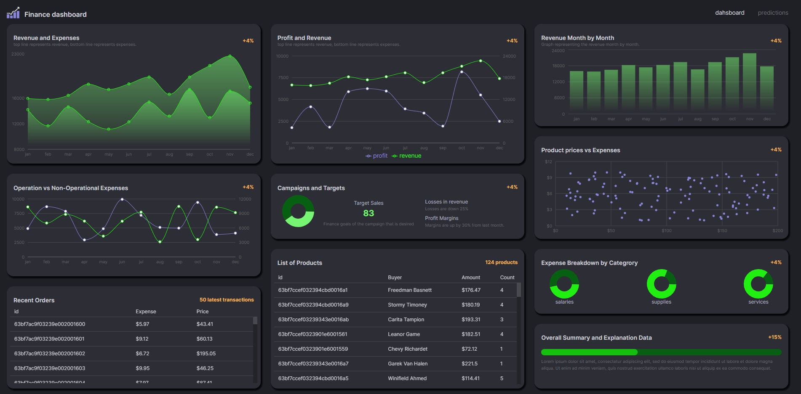
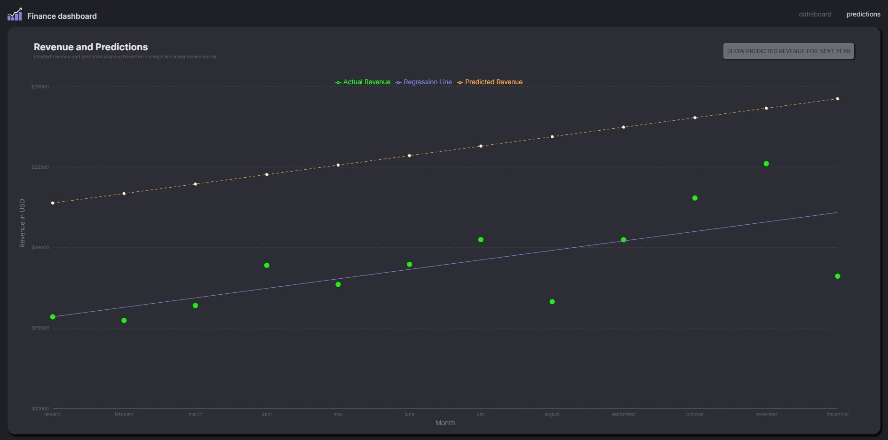

# Finance-Dashboard
Finance dashboard fullstack (MERN) app with redux-toolkit state management, written in React (Vite) and TypeScript. Frontend written in Vite, Redux-Toolkit, MUI (styles and components) and Recharts library (charts). Backend in Node.js, Express.js and MongoDB for database.

## 📦 Tech stack:
### Frontend
- React.js / Vite
- TypeScript
- Redux-toolkit
- MUI
- Recharts

### Backend
- Node.js
- Express.js
- MongoDB

## 💻 Demo
Click the link and check the app: [Link](https://ms-finance-dashboard.vercel.app/)

### Screenshot

 

## Environment variables:
After creating your own MongoDB database, add .env file to `server` directory and to add following data of your own:
MONGODB_URL="mongodb+srv://<your-username>:<your-password>.7km6ofs.mongodb.net/<your-database-name>?retryWrites=true&w=majorityk"
PORT="port number, e.g 8080"

Sample data in /client/data/data.js for data structure reference.
